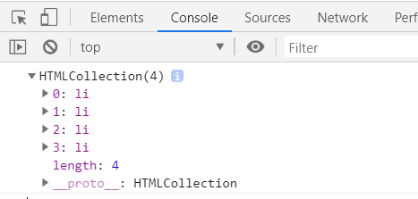
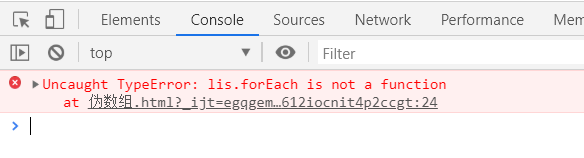
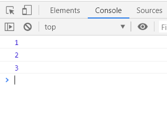

# 伪数组及其转换为真数组原理

## 什么是伪数组

定义：

1. 拥有`length`属性和数值下标属性。
2. 不具有真数组所具有的方法。

> 伪数组是一个`Object`，而真实的数组是一个`Array`

## 常见的伪数组

- 参数数组：`arguments`
- DOM对象列表`HTMLCollection`()：比如通过`document.getElementsByTagName`得到的列表
- `jquery`对象：比如`$("div")`

## 举例

通过`document.getElementsByTagName`得到的DOM对象列表是一个伪数组。

```html
<ul>
  <li>test1</li>
  <li>test2</li>
  <li>test3</li>
  <li>test4</li>
</ul>
```
```javascript
const lis = document.getElementsByTagName('li');
console.log(lis); // HTMLCollection(4) [li, li, li, li]
```

- 伪数组是一个`Object`，而真实的数组是一个`Array`
```javascript
console.log(lis instanceof Array);  // false
console.log(lis instanceof Object);  // true
```

- 拥有`length`属性和数值下标属性

```javascript
console.log(lis[1]);  // <li>test2</li>
console.log(lis.length); // 4
```

- 伪数组没有真实数组的方法

```javascript
console.log(lis.forEach) //undefined

lis.forEach((ele) => console.log(ele))
```

真实数组的`forEach()`方法：

```javascript
const ll = [1,2,3];
ll.forEach((ele) => console.log(ele))
```

## `Array.prototype.slice.call(lis)`将伪数组转换为真数组

```javascript
// Array.prototype.slice.call(lis)：将伪数组转换为真数组
  const lis2 = Array.prototype.slice.call(lis); // 相当于 lis.slice()
  console.log(lis2 instanceof Array);  //true
  console.log(lis2 instanceof Object);  //true
  console.log(lis2[1]);  // <li>test2</li>
  console.log(lis2.forEach);  // ƒ forEach() { [native code] }
```

### 原理

数组的`slice()`截取数组中指定部分的元素, 生成一个新的数组  [1, 3, 5, 7, 9],` slice(0, 3)`

```javascript
// slice2()
Array.prototype.slice2 = function (start, end) {
  start = start || 0
  end = start || this.length
  const arr = []
  for (var i = start; i < end; i++) {
    arr.push(this[i])
  }
  return arr
}
```

